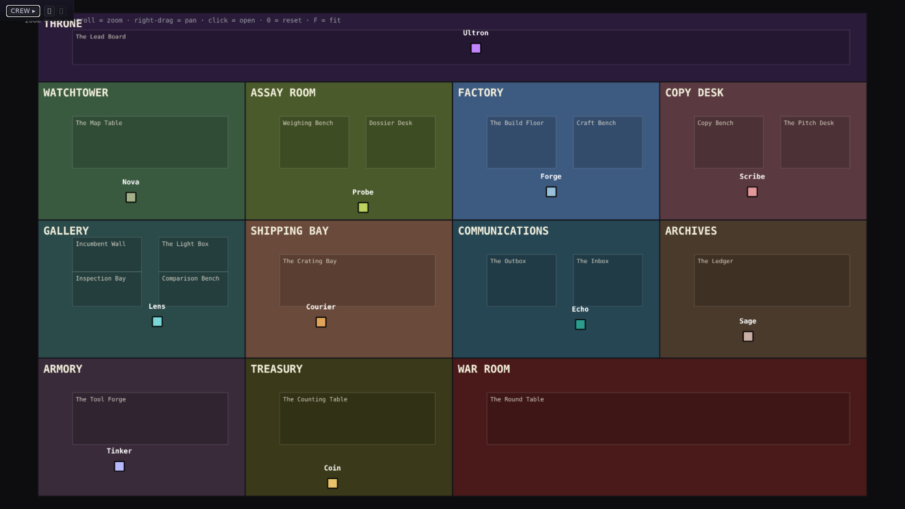
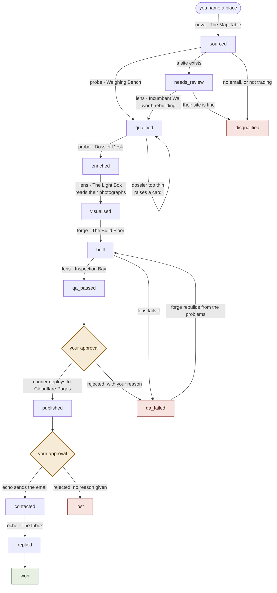
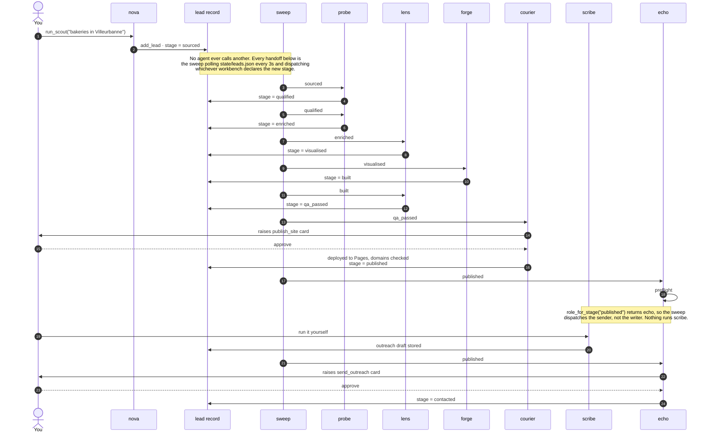

# agent_environment

An agent-operated web agency, rendered as a pixel-art dungeon.

Agents find local businesses that trade but have no website — or a bad one —
research them properly, build them a site on spec, verify it renders, publish a
preview, and email the owner a link and a quote. Each stage of that pipeline is
a **room**; each agent is a sprite you can watch walk between workbenches. You
sit above it and pass two approval gates.

Built on the [Claude Agent SDK](https://docs.claude.com/en/api/agent-sdk/overview).



---

## Why it looks like a game

Because a multi-agent pipeline is otherwise impossible to supervise. When six
agents are working, "which one is doing what, on which lead, and why is that one
idle" is the question you actually need answered, and a log doesn't answer it. A
room with labelled benches and a sprite standing at one does.

That's not decoration: the workbenches are the routing table. A room's manifest
declares which lead stages are worked at which bench, and that declaration is
what the dispatcher reads.

## The pipeline

The unit of work is a **Lead**. Every agent enriches the same record and moves
its stage; nothing reads "the most recent upstream artifact", because a dozen
leads sit at different stages at once.



The two diamonds are the only places it stops on its own. Everything else moves
without you: when a lead's stage changes, the room whose workbench declares that
stage is dispatched.

### Nothing calls anything

The diagram above says what happens to a lead. It doesn't show *how* a handoff
happens, and that turns out to be the more surprising half: **no agent ever calls
another one.** Each column below is a lifeline — the operator, the agents, and two
things that aren't agents at all: the lead record on disk, and the sweep that
polls it.



Read the columns and you can see the shape of the thing: every arrow either writes
a stage to the lead record or is the sweep dispatching off one. Steps 20 to 23 are
the gap that falls out of it — `role_for_stage("published")` returns `echo`, so the
sweep dispatches the sender and never the writer, and the pitch only gets written
if you run the Copy Desk yourself.

| Room | Agent | What happens there |
|---|---|---|
| Throne | Ultron | Reads the lead board, supervises, reviews tool requests |
| Watchtower | Nova | Sources businesses with no website (OpenStreetMap) |
| Assay Room | Probe | Qualifies cheaply, then researches the dossier properly |
| Gallery | Lens | Looks at things: their site, their photos, our build |
| Factory | Forge | Writes the actual site to disk |
| Copy Desk | Scribe | Site copy, and the outreach email + quote |
| Shipping Bay | Courier | Publishes a preview — **your approval** |
| Communications | Echo | Sends the outreach — **your approval** |
| Archives | Sage | Feedback ledger and activity log, fed back into agent context |
| Armory | Tinker | Writes new MCP tools at runtime when an agent lacks one |
| Treasury | Coin | Token spend per agent, cost per lead |

## The parts worth stealing

**Nothing may condemn a website it hasn't looked at.** An HTTP fetch cannot tell
a WAF block from a dead site — the first real lead returned 403 to every script
and 200 to a browser, and the pipeline nearly emailed a working restaurant to
say their site was broken. So `audit_website` returns `inconclusive`, never a
score, for 401/403/429/503, and only a model that has rendered a page in
Playwright and opened the screenshot is allowed to judge it.

**Photographs carry facts no text source has.** Reading a restaurant's published
photos recovered two priced dishes off a chalkboard, the real wall colour
(terracotta, where "French bistro" had us guessing burgundy), and the fact that
no exterior signage was legible in any of twelve photos — which is why that lead
needed a logo designed rather than reproduced.

**Every fact on a page carries a source URL.** The dossier is the only source of
page content, anything uncited is quarantined as `unverified`, and reviews are
context for the writer, never content for the page.

**Agents hire each other.** A room is staffed by up to three interchangeable
workers, hired when a second lead needs the room and retired when their lead
finishes. An agent mid-run can also hire a specialist for one subtask — a logo,
an icon set — which can ask another room to review its work before handing back,
then dies.

**Rooms are declarative.** Adding a room is adding `rooms/<id>.yaml`. Adding a
workbench is a few lines in one. Neither needs a Python or TypeScript change.

## Running it

```bash
uv venv .venv && uv pip install --python .venv/bin/python -e .
.venv/bin/python -m playwright install chromium     # Lens needs a real browser

cp -r prompts.example prompts                       # then write the prompts
cp .env.example .env                                # ANTHROPIC_API_KEY at minimum

PYTHONPATH=backend .venv/bin/python -m uvicorn agent_env.server:app --port 8765
# in another terminal
cd frontend && npm install && npm run dev            # http://localhost:5173
```

### The prompts are not in this repository

`prompts/` is gitignored. Every agent's role and output schema loads from
`prompts/<agent>/<NAME>.md` at startup, and `prompts.example/` documents what
each file is for without giving away the text. The server prints exactly which
files are missing if you skip this step.

That's the one part you'll have to write yourself, and it's most of where the
behaviour lives.

### Optional

- `AGENT_ENV_AGENCY_NAME` and `AGENT_ENV_SENDER_EMAIL` — outreach is **blocked**
  until these are set. Cold email without an identifiable sender and a working
  opt-out is both illegal in most places and undeliverable everywhere.
- `SMTP_*` — without these, approving a send hands you the email to send
  yourself rather than sending anything. A good way to start.
- The Factory can use [`ui-ux-pro-max`](https://github.com/nextlevelbuilder/ui-ux-pro-max-skill)
  for palette, type and accessibility data. It's gitignored for size; re-fetch
  its `.claude/skills/ui-ux-pro-max` subtree into `.claude/skills/`.

## Things the code enforces, because prompts are not guarantees

- **Quote, never invoice.** An unsolicited invoice is a deceptive-billing
  pattern. The draft is scanned for billing language and Echo's preflight blocks
  a flagged one.
- **No contact route, no lead.** A qualification without an email is overridden
  to disqualified.
- **Previews are marked.** Every published page gets `noindex` and an
  "unofficial preview, not affiliated" banner injected in code.
- **QA cannot pass unseen.** A `pass` without `visually_verified` is downgraded.
- **A build must produce files.** No `index.html` means the run failed, whatever
  the model reported — and a failed rebuild restores the previous build rather
  than leaving its debris.
- **One dispatch per lead per role**, claimed synchronously, because several
  things can dispatch the same work in the same instant.

## Legal reality, briefly

This builds unsolicited work for real businesses and emails real people. It is
set up for **small, hand-approved batches** — both gates exist for that reason.
Previews are `noindex` and clearly labelled as unaffiliated. Photographs found
on review platforms are read for information and never republished; the build
uses captioned image slots the owner fills. Cold B2B outreach in the EU is
workable on legitimate-interest grounds, but it needs genuine relevance, a real
sender identity and a working opt-out, and it collapses if you blast it.

Nothing here removes your responsibility for what gets sent.

## Layout

```
rooms/               room + workbench manifests, read by both sides
prompts/             agent prompts (gitignored; see prompts.example/)
backend/agent_env/   orchestrator, agents, tools, FastAPI + WebSocket server
frontend/            Vite + TS + Phaser SPA
state/               leads, generated sites, ledgers (gitignored)
```

`CLAUDE.md` is the working notes — the architecture, and a record of what broke
and why it's built the way it is. Read that before changing anything.

`docs/pipeline.html` is the same pipeline in more detail — every transition with
the agent and bench that performs it, the full room-to-stage routing table, and
what the code does that the plan doesn't say. Open it in a browser; it was
generated by reading `state.STAGES`, the `workbenches:` blocks and every
`advance_lead()` call site, so it describes the code rather than the intent.

## Licence

MIT.
