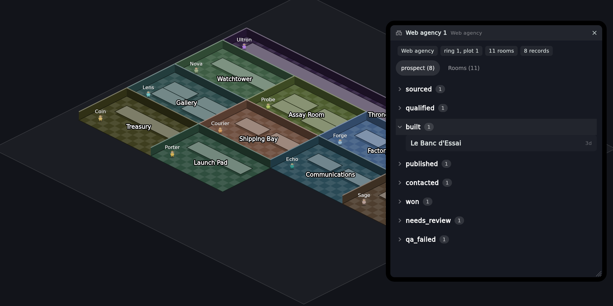
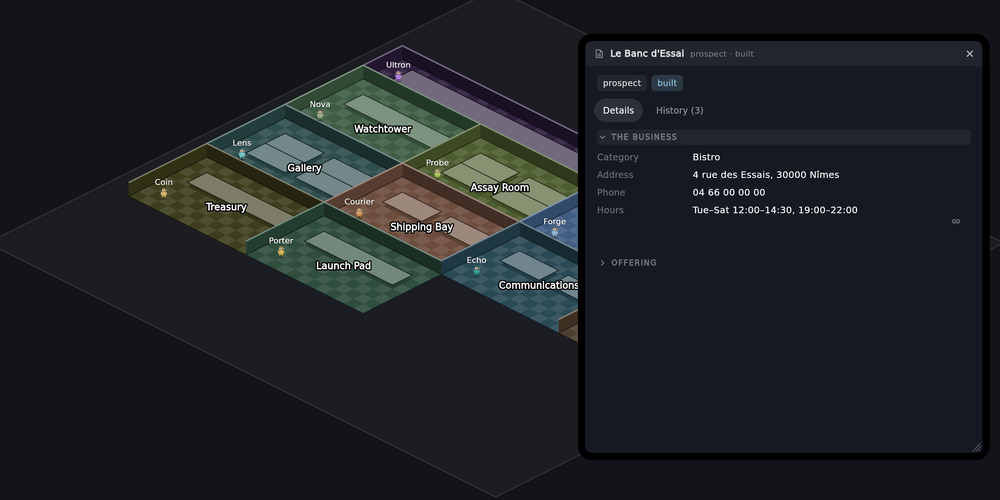

# Tanrim

An environment for running agent-operated work, drawn as a place you can walk
around.

Work moves through **rooms**. Each room is staffed by an **agent** that does
one kind of job; each unit of work is a **record** that moves from stage to
stage, gathering what each room produced. Anything irreversible or
outward-facing stops at a **gate** and waits for a person.

Tanrim itself knows none of that work. It owns the machinery — a world, a
worker pool, a durable ledger, an enforced state machine, an approval
mechanism, an agent runner and an HTTP surface — and every stage, room, agent,
gate, tool and route arrives from a **plugin**. An install with no plugins has
nothing to do, which is the correct empty state rather than an error.

Built on the [Claude Agent SDK](https://docs.claude.com/en/api/agent-sdk).


<table>
<tr>
<td></td>
<td></td>
</tr>
<tr>
<td><b>A castle</b> — one running instance of a plugin. Its work comes first
and its rooms last: you open a room to see what is in it, not to look at the
building.</td>
<td><b>A record</b> — drawn from a small block vocabulary the plugin answers
with. The history is the core's, built from the state machine for every kind
of work.</td>
</tr>
</table>

Regenerate them with `cd app && tool/screenshots.sh`. They are rendered from
the real widgets against a real dump of the rooms, so re-running the script is
the whole job of keeping them true — the picture this replaced was three weeks
old and predated castles, windows and the record view entirely. The businesses
on the board are invented; the real ledger holds people who have not been
contacted.

## What you get

- **A map of the work.** Rooms on an isometric world, one sprite per worker,
  walking to the bench it is working at. Zoom out and rooms give way to
  castles; a castle is one running instance of a plugin.
- **A state machine that is law.** Declared transitions are enforced, with an
  operator override that is recorded as one. Every move appends to the
  record's history in the same write, including which fields it produced.
- **Gates.** Anything that reaches the outside world waits for a person, and
  the card shows what saying yes does.
- **Concurrency that is accounted for.** Rooms hire extra workers on demand
  and retire them; one dispatch per record per role, claimed synchronously;
  token spend recorded per run, with cache reads and writes billed properly.
- **An app that manages the whole thing** — start and stop the server, install
  and disable plugins, build castles, read records, decide approvals.

## Running it

A plugin ships the Claude Code skills its rooms grant, under
`<plugin>/skills/`. Vendored third-party ones are not committed — they are
somebody else's work — so each plugin's own README says how to fetch them. A
room that grants a skill missing from disk loses it **silently**, so fetch
them before running one.

```bash
uv venv .venv && uv pip install --python .venv/bin/python -e ".[dev]"
.venv/bin/python -m playwright install chromium   # a reviewing agent LOOKS
cp .env.example .env                              # ANTHROPIC_API_KEY at minimum

.venv/bin/python -m uvicorn tanrim.server:app --port 8765
```

Then the app:

```bash
cd app
flutter run -d linux --release
```

`--release` matters — a debug build is un-optimised JIT, and this draws an
animated map.

`.env.example` carries plugin settings as well as the environment's own. It
has to: a plugin's variables are read from the same process, and one file you
can see beats three you cannot. Nothing in `backend/tanrim/` reads them.

The app can start the server for you: point it at this checkout in
**Settings → Server**. It guesses the path from where it was built.

## Installing a plugin

A plugin is a directory in `plugins/` with a `plugin.py` in it. `plugins/` is
gitignored here, so each plugin is its own repository: clone it in and reload.

```bash
git clone git@github.com:you/your-plugin.git plugins/your_plugin
curl -X POST http://127.0.0.1:8765/plugins/reload
```

Or use **Settings → Plugins** in the app, which clones, reloads, and lets you
switch a plugin off without deleting it.

Removing a plugin removes its stages, rooms, agents, gates, tools and routes
with it. There is a test that asserts exactly that — and the suite runs with
`plugins/` empty, skipping about sixty tests that have nothing to assert
against, because a checkout with no plugins is a legitimate state.

## Writing a plugin

Start with **[docs/CONTRACT.md](docs/CONTRACT.md)** — what a plugin IS, every
question the environment asks, and what the answers mean.

`plugins.example/` is a complete worked plugin kept small enough to read in
one sitting: a pipeline, a room with two benches, an agent, a gate, a step
gate, two kinds of hook, a record schema, prompts and a self-check. Copy the
directory into `plugins/` to run it — and rename its `id` and its stages
first, or its generic stage names will collide with an installed plugin's.

`tests/test_example_plugin.py` boots it and runs its job with the model
stubbed, so it cannot quietly rot again: it spent a while calling two `state`
functions that do not exist, booting perfectly and dying the first time
anybody pressed Run.

Or start from **[tanrim-plugin-template](https://github.com/emaurel/tanrim-plugin-template)**
— the same example plus tests that run and a walkthrough. It is a **private**
repository today, so the link 404s unless you have been given access:

```bash
gh repo create my-plugin --private --clone \
   --template emaurel/tanrim-plugin-template
mv my-plugin /path/to/tanrim/plugins/my_plugin
```

## Layout

```
backend/tanrim/     the environment — ~9,700 lines across 26 modules
app/                the operator's app — Flutter, ~7,400 lines in app/lib
plugins/            installed plugins (gitignored; clone them in)
plugins.example/    the worked example, deliberately not installed
state/              JSON ledgers and whatever plugins write
docs/CONTRACT.md    the plugin contract
CLAUDE.md           the architecture, and the reasoning behind it
```

The separation is enforced by tests rather than by convention:
`backend/tanrim/` may not import a plugin, may not name a stage or a role, and
may not serve a route about the work.

## Tests

```bash
.venv/bin/python -m pytest -q
```

Bare, with no path: `pytest.ini` sets `testpaths = tests plugins/*/tests`, and
naming a path overrides it — `pytest tests/` silently skips every plugin's
suite.

Runs the environment's suite plus every installed plugin's own — a plugin's
tests travel with it and still run by default.

## Status

Working software, under active development, with one operator. The interfaces
between the environment and its plugins are stable enough to build against;
the app changes often.
