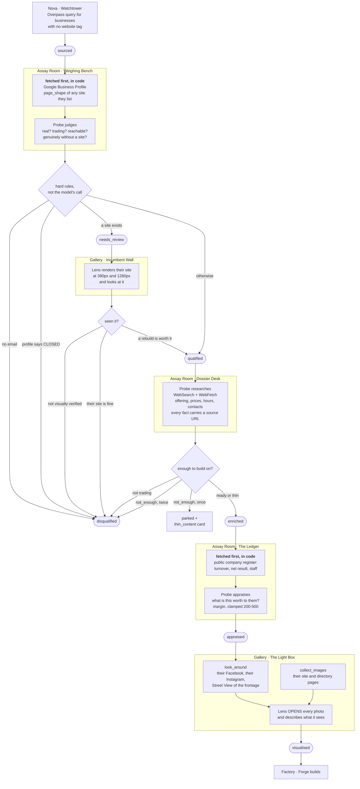

# The research half of the pipeline

From a name on a map to a dossier good enough to build from. Everything here
happens before Forge writes a line, and everything Forge writes is traceable to
something on this page.

Read from the code on 2026-09-03. Where this disagrees with the code, the code
is right and this is stale.

## The shape of it



## What each step actually costs and produces

| step | who | model tools | turns / budget | produces |
|---|---|---|---|---|
| source | Nova | `osm_business_search` | — | a lead per business, with an OSM node ref |
| qualify | Probe | `site_audit`, `social_look` — **no web search** | 16 / uncapped | `audit`, contact routes, a verdict |
| incumbent | Lens | `site_inspect` + Read | 20 | `review`, screenshots of their site |
| dossier | Probe | **WebSearch, WebFetch** | 30 / $1.50 | `profile` — offering, hours, sources, gaps |
| appraise | Probe | WebSearch, WebFetch | 14 / $0.75 | `appraisal`, `company_registry` |
| photos | Lens | `look_around`, `collect_images`, Read | 28 / $1.50 | `visual` — palette, boards, slots needed |

## What is decided in code, not by a model

These are the ones that must not depend on a model behaving:

- **No contact route, no lead.** A `qualified` verdict with no email becomes
  `disqualified`.
- **A site we have not SEEN cannot be called bad.** Any existing site forces
  `needs_review`, and Lens's `rebuild_worth_it` is downgraded unless it
  actually rendered and looked.
- **A profile that is not `OPERATIONAL` disqualifies outright** — one
  restaurant was researched four times after it had closed.
- **Twice "not enough to build on" disqualifies.** `not_enough` parks a lead
  at `qualified`, which is also the stage that dispatches research, so a
  second identical verdict is a loop rather than a decision.
- **The domain price is fetched, not estimated**, and the quote says which.
- **The margin is clamped** to 200–500 whatever the appraisal recommends.

## Where it is weakest

Honest list, in the order I would fix them.

**1. Qualification cannot search the web.** It has `site_audit` and
`social_look` and no `WebSearch` or `WebFetch` — so it judges "do they have a
website" mostly from the absence of an OSM tag and from candidate domain
names. That is exactly how a restaurant running a site on a builder subdomain
was qualified as having no web presence, and how a domain that is a 104-byte
redirect to Instagram nearly went the same way. The Google Business Profile
lookup closes most of this, but only once the key is set.

**2. Two sources are inert without a key.** Google Places and Street View both
wait on `GOOGLE_MAPS_API_KEY`. Places is the single highest-value addition
here: it answers "do they have a site", "when are they open" and "are they
still trading" from the listing the business itself maintains.

**3. `collect_images` scrapes whoever the page is about.** Pointed at a
directory listing it returns photographs of every business on it — one harvest
came back with twelve pictures of neighbouring salons. `look_around` fixes the
social case by reading the account itself; the directory case is still noisy
and relies on Lens discarding what is plainly not theirs.

**4. Half the leads have no social account recorded.** Four of nine had a
Facebook page. `look_around` now reads the accounts a business links from its
own site, which finds some of them, but a business with no site and no
recorded account is still invisible to this step.

**5. The register match is a guess for anyone who did not file.** A trading
name is rarely the legal name, so the search is a cascade and a name-only
match is labelled `check this` — one lead matched a company called *3M POSE*,
which is not a charcuterie. Only a SIREN found in the dossier gives certainty.

**6. Instagram posts come back at 360–640px.** Enough to read a chalkboard
sometimes, not reliably. The full-resolution image is behind a signed URL.

**7. The appraisal is thin when nobody files accounts.** Most small businesses
publish nothing, so the margin usually rests on proxies — staff count, number
of sites, ticket prices, opening hours. The prompt is explicit that absence is
not evidence of being small, but a proxy-based number is still a judgement.

## What feeds the price

```
quote = margin + (registration + 9 renewals of the actual domain)
        └─ appraised 200-500, from the register and the proxies
                                  └─ fetched live from OVH, per name,
                                     because the same .fr is 4.99 to
                                     register and 7.79 to renew
```
